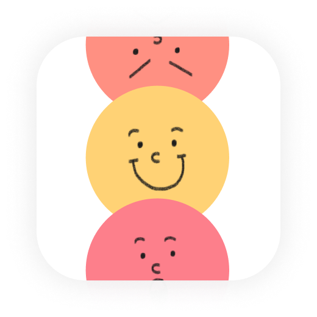
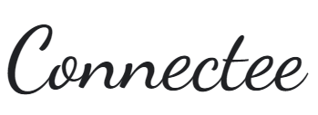
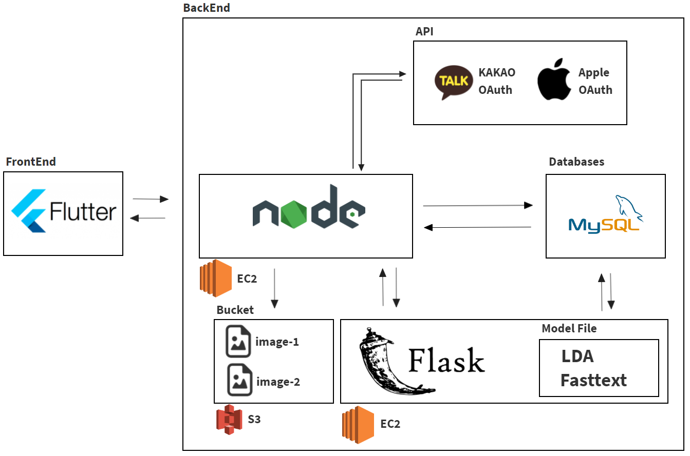
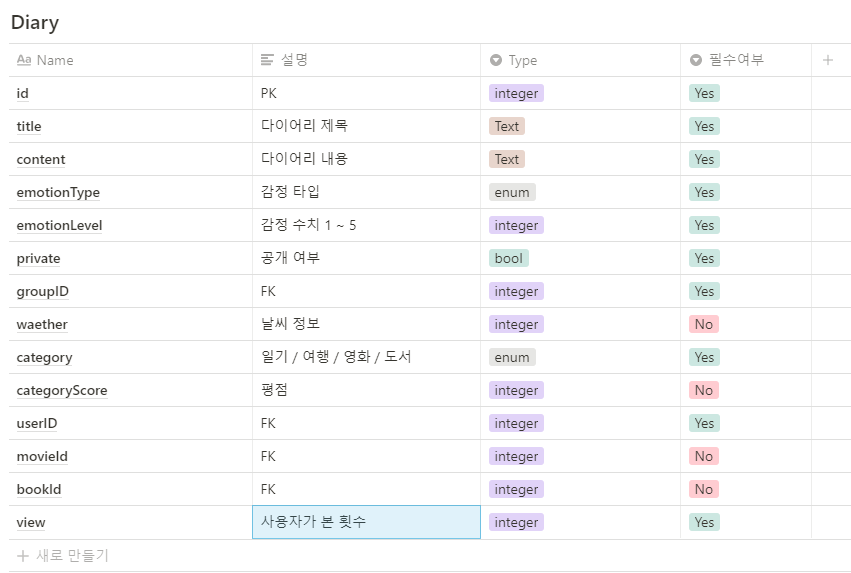

## 📄프로젝트 개요

사용자가 자신의 감정 상태를 7가지 감정 종류에 따라 수치화하여 입력한 뒤, 그 감정에 관한 **다이어리를 작성하고 공유하는 플랫폼입니다.** 
감정을 사용자 측으로부터 직접 입력받기 때문에, 감정에 따른 사용자의 글을 분석하고 감정 데이터를 기반으로 글을 분석하여 **감정을 판단하는 정부 과제에 기여 할 수 있습니다.** 

➡️ **감정 기반 공유 다이어리**

​    **커넥티**는 공유의 개념을 넘어서  마음맞는 사람들끼리 친근하게 접근할 수 있는 SNS을 추구합니다.
   감정을 효과적으로 표현하고 익명성을 근거하여 자신 그대로를 드러 낼 수 있습니다.

➡️ **관심사 맞춤 다이어리 추천**

​	  입력받은 감정과 다이어리, 사용자가 자주 보는 다이어리의 관심사를 분석하여 사용자에게 다이어리를 추천합니다.

➡️ **사람에 집중 하는 것이 아닌 ✔️다이어리✔️ 자체에 집중**

​	팔로우/ 팔로잉 기능과 익명의 댓글로 인해 자신의 감정을 솔직하게 표현하지 못하는 다른 SNS
​    와는 다르게 공감대가 형성된 사용자들의 글을 위주로 접할 수 있고, 그 사용자들은 그들만의 그룹을 만들어 
​    내적 친밀감을 향상할 수 있습니다.

## 🧷프로젝트 기능 

| 프로젝트 기능                           | 상세 내용                                                    |
| --------------------------------------- | :----------------------------------------------------------- |
| **감정 공유 다이어리**                  | 자신의 감정을 수치화해서 입력 입력된 감정을 시각화해서 글과 함께 공유 감정을 내포하는 다양한 이모지를 통해 공감 표현 가능- 영화, 독서에 대한 다이어리를 쉽게 작성 할 수 있도록 제공 자신만이 볼 수 있는 기본 다이어리 기능 제공 |
| **관심사**, **감점 기반 다이어리 추천** | **관심사 및 감정에 맞는 익명의 다이어리 추천**               |
| **그룹 네트워킹**                       | **공감이 형성된 사용자들 사이에 공유되는 그룹 다이어리 제공- 감정 분석에 따른 유대감을 형성시킬만한 그룹 추천 기능** |

# ⚙기술 스택  

   

## 🗂 시스템 구성도  

  

## 📔 DB 구조 

자세한 DB구조는 [Connectee 데이터베이스 명세서](https://pool-periodical-7cf.notion.site/023c35c1f3174a3abdcf2c935d48dcfa) 를 확인해 주세요.

## 📌결과물 형태

 `

## 팀원 프로젝트 깃랩 주소

##### 백앤드 깃랩 주소:  [백앤드](https://git.swmgit.org/swm-12/12_swm10/sw_connectee)

##### 추천 시스템 깃랩 주소: [추천 시스템](https://git.swmgit.org/swm-12/12_swm10/connecttee_recommand)

##### 피그마 주소 : [피그마](https://www.figma.com/file/ybkpbDkOJO1qpkBXtffw92/Connectee?node-id=0%3A1)

## 🧑‍💻 팀원 소개  

##### 김호준[@hojun3775](https://git.swmgit.org/hojun3775)

##### 이재웅 [@QuiD-0](https://github.com/QuiD-0)

##### 허준현 [@denhur62](https://github.com/denhur62)

##### "디자인" 김영진 [@엉진](https://www.notion.so/Lee-Yeongjin-eb316edd11b24deaa7f1af1ffa005861)

